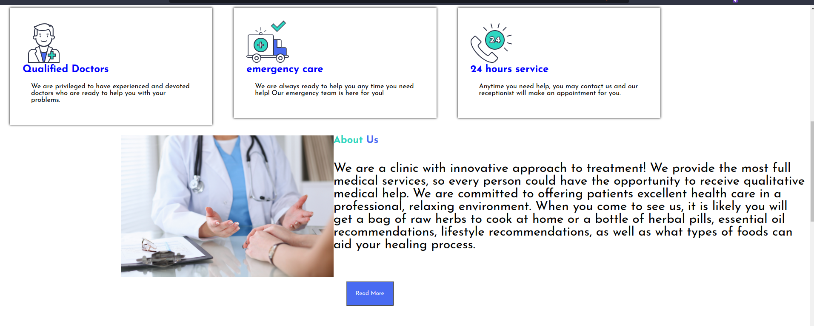
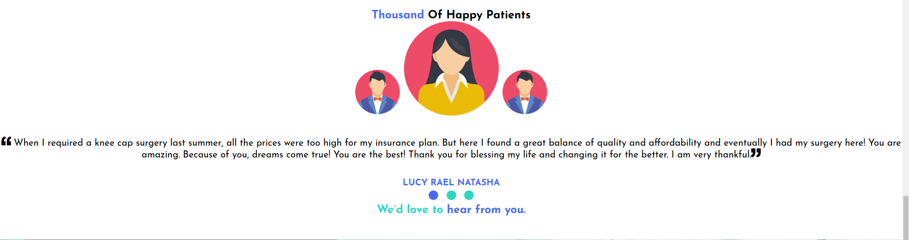

# MEDIC-CARE-CLINIC
____
# Project Description
____
Medic-Care is a website for an innovative  medical company where clients can visit the website and learn more about the years treatment and what services the company offer.

# Technologies Used
* HTML
* CSS
 # live link
 To acces this project live use this [link](https://github.com/mahcee/medic-care.git)
# Project Set up and Installation.
1. Open the terminal and navigate to where you want to store the project.eg.`cd Desktop`
2. To clone the git hub project place this on the terminal `git clone https://github.com/mahcee/medic-care.git`
3. Use `cd medic-care`to get into the project's directory.
4. Open the project with your favourite web browser.
 # Contact
 If you would like to get in touch for feedback use this email address **mercie6133@gmail.com**
# license
MIT License

Copyright (c) [2024] [***mercy mwende***]

Permission is hereby granted, free of charge, to any person obtaining a copy
of this software and associated documentation files (the "Software"), to deal
in the Software without restriction, including without limitation the rights
to use, copy, modify, merge, publish, distribute, sublicense, and/or sell
copies of the Software, and to permit persons to whom the Software is
furnished to do so, subject to the following conditions:

The above copyright notice and this permission notice shall be included in all
copies or substantial portions of the Software.

THE SOFTWARE IS PROVIDED "AS IS", WITHOUT WARRANTY OF ANY KIND, EXPRESS OR
IMPLIED, INCLUDING BUT NOT LIMITED TO THE WARRANTIES OF MERCHANTABILITY,
FITNESS FOR A PARTICULAR PURPOSE AND NONINFRINGEMENT. IN NO EVENT SHALL THE
AUTHORS OR COPYRIGHT HOLDERS BE LIABLE FOR ANY CLAIM, DAMAGES OR OTHER
LIABILITY, WHETHER IN AN ACTION OF CONTRACT, TORT OR OTHERWISE, ARISING FROM,
OUT OF OR IN CONNECTION WITH THE SOFTWARE OR THE USE OR OTHER DEALINGS IN THE
SOFTWARE.